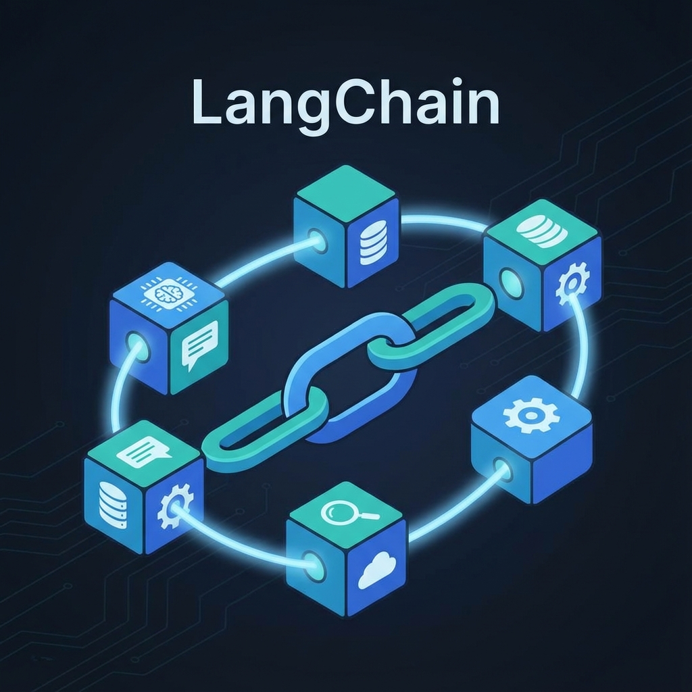

# LangChain 기본개념 🔗

LangChain은 대규모 언어 모델(LLM)을 사용하여 애플리케이션을 더 쉽게 개발할 수 있도록 돕는 프레임워크입니다. 다양한 컴포넌트를 '사슬(Chain)'처럼 연결하여 복잡한 작업을 수행할 수 있게 해줍니다.



---

## 1. 환경 설정 및 보안

코드를 작성하기 전, 설정을 안전하게 관리하고 사내 네트워크 환경에 맞추는 작업이 필요합니다.

### .env 파일이란?
`.env` 파일은 프로젝트의 **환경 변수(Environment Variables)**를 저장하는 텍스트 파일입니다.

- **왜 필요한가?**: API 키나 엔드포인트와 같은 민감한 정보를 코드에 직접 적지 않고 별도로 관리하기 위해서입니다. 이렇게 하면 실수로 보안 정보가 깃허브(GitHub) 등에 노출되는 것을 방지할 수 있습니다.

**.env 예시**
```bash
AZURE_OPENAI_API_KEY=여러분의_API_키
AZURE_OPENAI_ENDPOINT=여러분의_엔드포인트_URL
```

### 사내 인증서 및 추적 설정
사내 네트워크에서 SSL 인증서 문제로 접속이 안 될 때 `truststore`를 사용하며, 실행 과정을 확인하기 위해 `phoenix`로 트레이싱을 설정합니다.

> 💡 **트레이싱 설치 및 가이드**: [Arize Phoenix 설정 바로가기](../../../setup/libs/phoenix.md){:target="_blank"}

---

## 2. 기본 실행 방식 (Invoke & Stream)

가장 기본적인 호출 방식입니다. 질문을 던지고 한 번에 답을 받거나, 글자가 생성되는 대로 실시간으로 받을 수 있습니다.

```python
import os
import truststore
from dotenv import load_dotenv
from phoenix.otel import register
from langchain_openai import ChatOpenAI

# 1. 사내 인증서 적용 및 환경 변수 로드
truststore.inject_into_ssl()
load_dotenv(override=True)

# 2. Phoenix 트레이싱 설정
tracer_provider = register(
  project_name="llm-practice1",
  auto_instrument=True
)

# 3. 모델 초기화
model = ChatOpenAI(
    model="gpt-4.1-mini",
    base_url=os.getenv("AZURE_OPENAI_ENDPOINT"),
    api_key=os.getenv("AZURE_OPENAI_API_KEY"),
)

messages = [
    ("system", "You are a helpful assistant."),
    ("human", "대한민국의 수도는 어디야? 고조선때부터로 알려줘"),
]

# --- 실행 방식 ---

# [방법 1] invoke: 결과가 다 나올 때까지 기다렸다가 한 번에 받기
response = model.invoke(messages)
print("--- [Invoke 결과] ---")
print(response.content)

# [방법 2] stream: 생성되는 대로 실시간으로 한 글자씩 출력하기
print("\n--- [Stream 결과] ---")
for chunk in model.stream(messages):
    print(chunk.content, end="", flush=True)
```

---

## 3. 비동기 실행 (Asynchronous)

프로그램이 LLM의 답변을 기다리는 동안 다른 일을 멈추지 않고 계속할 수 있게 하는 방식입니다.

### 비동기(Async)란 무엇인가?
- **개념**: "결과가 나올 때까지 기다리지 않고 다음 줄을 실행한다"는 뜻입니다. LLM 답변은 보통 몇 초 이상 걸리는데, 이 시간 동안 웹 서버가 멈춰있거나 UI가 프리징(Freezing)되지 않도록 돕습니다.
- **어떤 상황에 필요한가?**: 
    1. 여러 사용자의 요청을 동시에 처리해야 하는 웹 서비스
    2. 여러 개의 LLM 호출을 동시에 병렬로 실행할 때
    3. 실시간 UI 응답성을 유지해야 할 때

```python
# --- 비동기 실행 방식 (await가 필요함) ---

# [방법 1] ainvoke: 비동기로 호출하고 결과 기다리기
async def run_ainvoke():
    response = await model.ainvoke(messages)
    print(response.content)

# [방법 2] astream: 비동기로 실시간 스트리밍 받기
async def run_astream():
    async for chunk in model.astream(messages):
        print(chunk.content, end="", flush=True)

# 노트북이나 스크립트에서 실행 시 await 또는 asyncio.run() 사용
# await run_ainvoke()
# await run_astream()
```

---

## 4. LCEL과 구조화된 출력 (Structured Output)

LangChain의 진정한 힘은 여러 구성 요소를 `|` (파이프) 연산자로 연결하는 **LCEL(LangChain Expression Language)**에서 나옵니다.

### LCEL: 컴포넌트 연결하기 (|)
`Prompt | Model | OutputParser` 순서로 연결하면, 프롬프트가 모델로 전달되고 그 결과가 자동으로 파싱되는 하나의 '사슬(Chain)'이 완성됩니다.

```python
from langchain_core.prompts import ChatPromptTemplate
from langchain_core.output_parsers import StrOutputParser

# 1. 프롬프트 템플릿 정의
prompt = ChatPromptTemplate.from_messages([
    ("system", "당신은 요리 전문가입니다. 사용자의 재료에 맞는 요리를 추천하세요."),
    ("human", "{ingredients}로 만들 수 있는 요리 하나 추천해줘.")
])

# 2. 출력 파서 (모델의 응답에서 텍스트만 추출)
output_parser = StrOutputParser()

# 3. 체인 구성 (LCEL)
chain = prompt | model | output_parser

# 4. 실행
result = chain.invoke({"ingredients": "계란, 토마토"})
print(result) # 출력 파서 덕분에 결과.content 대신 바로 문자열이 나옵니다.
```

### Structured Output: 정해진 양식으로 답변받기
AI의 답변을 자유로운 텍스트가 아니라, 프로그램이 처리하기 쉬운 **JSON이나 객체 형태**로 받고 싶을 때 사용합니다.

```python
from typing import List
from pydantic import BaseModel, Field

# 1. 원하는 출력 구조 정의 (Pydantic 사용)
class Recipe(BaseModel):
    name: str = Field(description="요리 이름")
    ingredients: List[str] = Field(description="필요한 재료 목록")
    steps: List[str] = Field(description="조리 단계")

# 2. 모델에 구조화된 출력 기능 추가
structured_model = model.with_structured_output(Recipe)

# 3. 체인 구성 및 실행
structured_chain = prompt | structured_model
recipe_result = structured_chain.invoke({"ingredients": "사과, 시나몬"})

# 결과는 Recipe 객체 형태로 반환됩니다.
print(recipe_result.name)
print(recipe_result.ingredients)
```

---

## 요약 📝

1. **.env**: 보안을 위해 비밀 정보를 분리 보관하는 장소
2. **truststore**: 사내 네트워크 인증 문제를 해결하는 마법사
3. **Invoke/Stream**: 정석적인 호출과 실시간 호출
4. **Async**: 멈추지 않고 동시에 여러 일을 하기 위한 기술
5. **LCEL (|)**: 여러 도구를 하나로 묶어주는 강력한 연결 고리
6. **Structured Output**: AI의 답변을 프로그램이 이해하기 쉬운 규격으로 받는 방법
