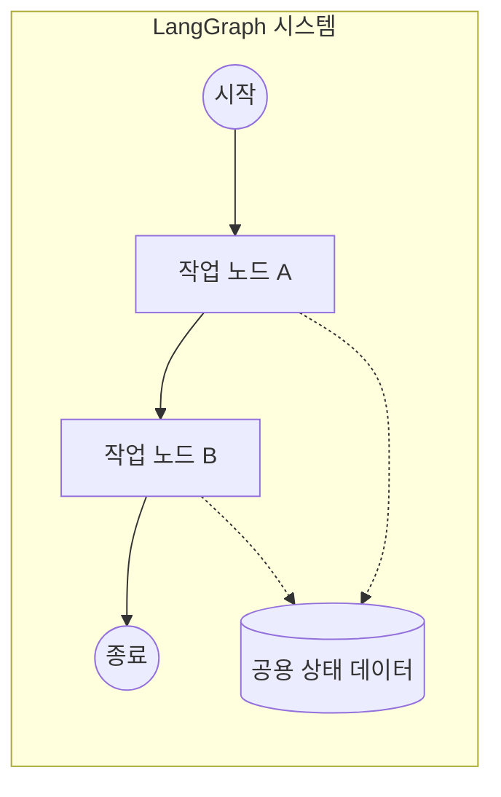

# LangGraph 기본개념 (초보자용)

LangGraph는 어렵게 느껴질 수 있지만, 사실 **"데이터 흐름을 정해진 순서대로 처리하는 시스템"**이라고 생각하면 이해하기 쉽습니다.


---

## 1. 핵심 용어 이해하기

LangGraph의 핵심 개념을 일상적인 비유로 바꿔서 이해해 보겠습니다.

| 용어 | 비유 | 설명 |
| :--- | :--- | :--- |
| **State (상태)** | **공용 메모장** | 모든 작업 단계에서 공유하고 업데이트하는 데이터 저장소입니다. |
| **Node (노드)** | **작업 단계** | 메모장의 데이터를 읽어서 특정 작업을 수행하고 결과를 다시 메모장에 쓰는 함수입니다. |
| **Edge (엣지)** | **흐름 선** | 다음 작업 단계로 어떻게 이동할지 결정하는 규칙입니다. |
| **Graph (그래프)** | **전체 프로세스** | 노드와 엣지, 상태가 하나로 묶인 전체 작업 설계도입니다. |

---

## 2. 데이터 처리 흐름 (도식화)

노드들이 상태(State)를 중심으로 어떻게 상호작용하는지 살펴보세요.


### 개념적 구조 (Mermaid)


---

## 3. 단계별 구현 가이드

초보자도 따라 할 수 있도록 가장 단순한 형태의 그래프를 만들어 보겠습니다.

### 1단계: 상태(State) 정의
먼저 시스템이 어떤 데이터를 다룰지 정해야 합니다. 여기서는 메시지를 담을 리스트를 정의합니다.

```python
from typing import Annotated
from typing_extensions import TypedDict
from langgraph.graph.message import add_messages

# 상태 정의: 메시지 목록을 상태로 관리
class State(TypedDict):
    # add_messages는 새로운 메시지를 기존 목록에 추가해주는 역할을 합니다.
    messages: Annotated[list, add_messages]
```

### 2단계: 노드(Node) 정의
실제 작업을 수행할 함수를 만듭니다. 입력받은 상태를 확인하고 새로운 내용을 추가합니다.

```python
def my_node(state: State):
    # 현재 상태에서 메시지를 읽어와서 처리를 수행합니다.
    print(f"현재 메시지 수: {len(state['messages'])}")
    return {"messages": [("ai", "작업이 완료되었습니다!")]}
```

### 3단계: 그래프(Graph) 구축

여기서 초보자분들이 가장 많이 하는 질문이 있습니다. 
**"이미 State를 정의했는데, 왜 또 `StateGraph(State)`라고 선언하고 거기에 노드를 붙여야 하나요?"**

이유는 아주 간단합니다:
- **State**는 데이터가 담길 **'그릇의 모양'** (설계도)이고,
- **StateGraph**는 그 그릇을 들고 다니며 실제로 일을 할 **'작업장 전체'**이기 때문입니다.

`workflow = StateGraph(State)`라고 선언하는 것은, **"이제부터 이 작업장 안의 모든 노드(작업자)들은 'State'라는 모양의 그릇만 사용하도록 규칙을 정하겠다!"**라고 선포하는 것과 같습니다. 이렇게 해야 모든 노드가 서로 같은 데이터를 공유하며 협업할 수 있습니다.

```python
from langgraph.graph import StateGraph, START, END

# 1. 그래프 빌더 생성 (State라는 규칙을 가진 작업장 만들기)
workflow = StateGraph(State)

# 2. 노드 추가 (이 작업장에 작업자 배치하기)
workflow.add_node("process_node", my_node)

# 3. 엣지 연결 (작업자 사이의 흐름 설정)
workflow.add_edge(START, "process_node")
workflow.add_edge("process_node", END)
```

### 4단계: 컴파일 및 실행
설계도를 바탕으로 실제 실행 가능한 앱을 만듭니다.

```python
# 1. 컴파일
app = workflow.compile()

# 2. 실행
result = app.invoke({"messages": [("user", "안녕하세요")]})

# 결과 출력
print(result["messages"])
```

---

## 4. 요약 📝

1. **State**: 한 바구니에 담긴 **공유 데이터**
2. **Node**: 바구니에 든 데이터를 처리하는 **작업자**
3. **Edge**: 작업자 사이의 **이동 경로**
4. **Graph**: 이 모든 흐름이 담긴 **설계도**

LangGraph는 이처럼 복잡한 로직을 작은 단위(Node)로 나누고, 이를 유연하게 연결(Edge)하여 관리할 수 있게 해주는 강력한 도구입니다.
